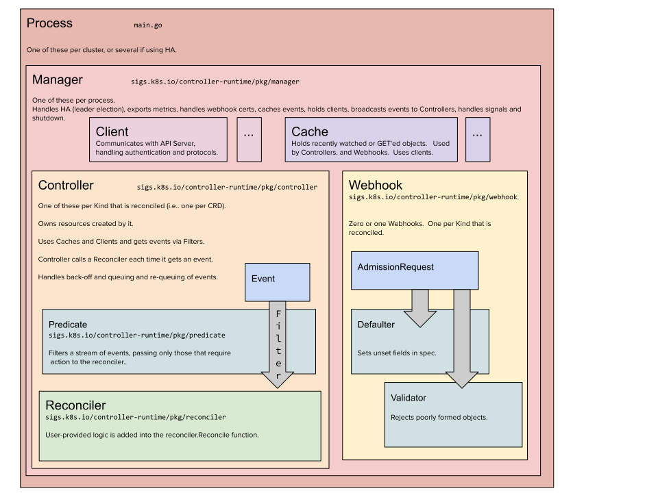

## Overview

The vast majority of the following documentation summarizes information from the following sources:

- [`kubebuilder` Book](https://book.kubebuilder.io)
- [The Operator Pattern](https://kubernetes.io/docs/concepts/extend-kubernetes/operator/#:~:text=Operators%20are%20software%20extensions%20to,principles%2C%20notably%20the%20control%20loop.)
- [Extending Kubernetes](https://kubernetes.io/docs/concepts/extend-kubernetes/api-extension/)
- [Managing TLS in a Cluster](https://kubernetes.io/docs/tasks/tls/managing-tls-in-a-cluster/)

The operator uses [`kubebuilder`](https://github.com/kubernetes-sigs/kubebuilder) -- _a kubernetes special interest group project_ -- to bootstrap the codebase.
Further configuration is done via [`kustomize`](https://github.com/kubernetes-sigs/kustomize).

## Architecture



## Operators

A Kubernetes operator controller, often simply called an operator, is a method of packaging, deploying, and managing a 
Kubernetes application. A Kubernetes application is both deployed on Kubernetes and managed using the Kubernetes API and 
kubectl tooling. To understand what an operator is, it's helpful to understand the problems it solves.

### What It Solves

Kubernetes provides a robust framework for managing containerized applications in a clustered environment. However, while 
Kubernetes handles the deployment and running of applications, it doesn't natively understand how to manage the application 
lifecycle beyond that. For example, how do you handle version upgrades, backups, or recovery from failures? This is where
operators come in.

### Components of an Operator

An operator extends Kubernetes to automate the management of the entire lifecycle of a particular application. It is 
composed of two key components:

1. **Custom Resource Definitions (CRDs):** These extend the Kubernetes API to include new custom resources. CRDs define the specifications of the resources that are specific to an application, such as a database cluster or a monitoring agent. Through CRDs, you can manage applications in a more declarative way, specifying the desired state of the application's components.

2. **Controller:** This watches for changes to those custom resources and other relevant events through the Kubernetes API. When it detects a change, it makes the current state of the application converge towards the desired state specified by the CRD. For example, if a database cluster's CRD specifies three replicas but only two are running, the operator's controller would start another replica to meet the specified state.

### How It Works

The operator pattern takes advantage of Kubernetes' extensibility and its control loop mechanisms. Operators are
essentially software extensions to Kubernetes that use custom resources to manage applications and their components
in a more automated manner. Here's a simplified workflow:

1. **Define a CRD** for your application, specifying the desired state of its components.
2. **Deploy the operator** to your Kubernetes cluster. The operator includes a controller that constantly monitors the custom resources associated with your application.
3. **Controller reacts to changes:** When a change is made to a custom resource (e.g., updating the configuration), the controller interprets this change and takes action to ensure the application reaches the desired state (e.g., updating an application component).

### Use Cases

Operators are particularly useful for stateful applications that require complex management tasks, such as databases, 
caches, and monitoring systems. They automate tasks like backups, scaling based on load, and updating without downtime.

### Conclusion

Kubernetes operators provide a powerful way to automate the management of complex applications on Kubernetes. By extending 
the Kubernetes API through CRDs and implementing custom logic in a controller, operators can automate tasks that would 
otherwise require manual intervention, making the management of applications more efficient and reliable.

## Setup Recall Instructions

```bash
kubebuilder init --domain tutorial.kubebuilder.io --repo tutorial.kubebuilder.io/project --project-name=<dns1123-label-string>

```

## External Reference(s)

- [SOCKS5 Proxy w/Kubernetes](https://kubernetes.io/docs/tasks/extend-kubernetes/socks5-proxy-access-api/)
- [OpenSSH](https://man.openbsd.org/ssh)
- [Markers](https://book.kubebuilder.io/reference/markers)
- [Markers, Validation](https://book.kubebuilder.io/reference/markers/crd-validation)


rbidden: User "system:serviceaccount:analytics-system:analytics-controller-manager" cannot list resource "pods" in API group "" a
kubectl auth can-i list Pod --as system:serviceaccount:analytics-system:analytics-controller-manager
